# Torque Takehome: Deploying a Simple Environment

**Submitted by:** Christian Justo
**Role:** Solutions Architect, Quali
**Submission date:** 2026-05-22

## TL;DR

This repository contains a complete Torque blueprint that provisions a Google Cloud Storage bucket through a single Terraform grain. The Terraform module is intentionally minimal so the documentation can focus on how Torque composes IaC into an environment rather than on the resource itself. A GitHub Actions workflow guards the Terraform code with `fmt`, `validate`, and `tflint` on every change. Screenshots from the end-to-end launch are in [`docs/screenshots/`](./docs/screenshots/).

## Repository layout

```
.
├── README.md                                 you are here
├── terraform/                                the grain: a self-contained TF module
│   ├── main.tf                               GCS bucket resource + random suffix
│   ├── variables.tf                          inputs with type + validation
│   ├── outputs.tf                            outputs exposed back to Torque
│   └── versions.tf                           provider and Terraform pinning
├── blueprints/
│   └── simple-environment.yaml               Torque blueprint (spec_version 2)
├── helm/                                     bonus grain: Helm chart for K8s
│   └── bucket-info/
│       ├── Chart.yaml
│       ├── values.yaml
│       └── templates/
│           └── configmap.yaml                ConfigMap stamped with bucket name
├── .github/workflows/
│   └── terraform-validate.yml                fmt + validate + tflint on PR/push
├── docs/screenshots/                         end-to-end run evidence
└── .gitignore                                blocks state, tfvars, and SA keys
```

## Why GCP?

The assignment allows AWS, Azure, or GCP. I chose GCS (Google Cloud Storage) because I had a personal GCP project already configured. The Torque integration pattern is identical across clouds: a service account credential is held in Torque's Parameter Store, injected into the Terraform grain at launch as an environment variable, and consumed by the relevant provider. The same blueprint shape works for AWS by swapping the env vars (`AWS_ACCESS_KEY_ID` / `AWS_SECRET_ACCESS_KEY`) and the underlying module.

## Architecture

Three Torque primitives compose the environment:

1. **Repository.** This Git repo is registered in Torque as a source. Torque's asset discovery walks the tree and identifies both the Terraform module at `terraform/` and the Helm chart at `helm/bucket-info/` as grain candidates.
2. **Grains.** Two grains are composed in the same blueprint: a `kind: terraform` grain that provisions the GCS bucket, and a `kind: helm` grain that deploys a ConfigMap into the K8s cluster the agent is running on. The Helm grain reads outputs from the Terraform grain (`{{ .grains.gcs_bucket.outputs.bucket_name }}`) and stamps them into the ConfigMap data. Torque resolves the cross-grain dependency automatically via the output reference: the Helm grain doesn't run until the Terraform grain has reported its outputs.
3. **Blueprint.** The blueprint at `blueprints/simple-environment.yaml` defines the operator-facing inputs (project, region, bucket prefix, namespace, agent selection), composes the two grains, and re-exposes the Terraform outputs at the environment level so they appear in the Torque UI.

A Kubernetes-based Torque agent runs both grains in sequence. For the Terraform grain it pulls the module from the connected repo, executes `terraform init/plan/apply` against the GCP provider using credentials supplied through Torque's Parameter Store, and reports outputs and state back to the control plane. For the Helm grain it runs `helm install` against the cluster it's running in, with values set from the Terraform outputs and the operator's namespace input.

## Implementation walkthrough

The six steps below mirror the PDF.

### 1. Install the Torque agent

Provisioned a small GKE cluster as the agent host (see the [Challenges & Workarounds](#challenges--workarounds) section for why local minikube was not an option). Followed the agent install wizard in the Torque UI; it generated a Kubernetes manifest containing a dedicated namespace, a service account, and a deployment running the `quali/kubernetes-agent` image. Applied with `kubectl apply -f <manifest>` against the GKE cluster.

After applying the manifest, the agent registered itself with the Torque control plane and showed up healthy in the **Agents** view.

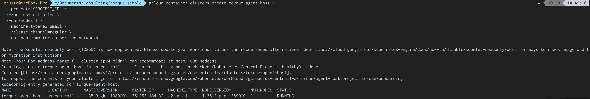
*GKE cluster `torque-agent-host` provisioned in `us-central1-a`. Single-node default pool was later rolled to `e2-standard-2`; see Challenges section.*

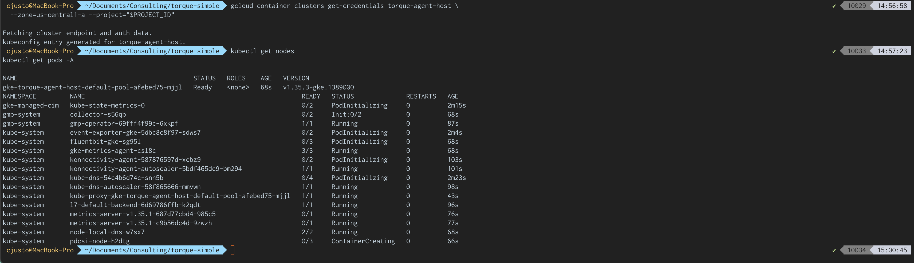
*kubectl pointed at the new cluster, node Ready, kube-system pods still coming up (mix of Running, ContainerCreating, and Init states). Cluster is operational and ready to accept the Torque agent manifest; system pods finish stabilizing within a minute or two.*

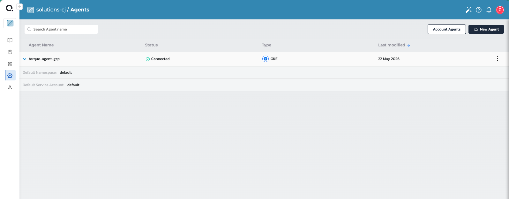
*Agent connected to the Torque control plane with default namespace and default service account, type GKE.*

### 2. Create and commit the Terraform module

The module under [`terraform/`](./terraform/) provisions a single `google_storage_bucket` resource with the following non-default settings, each of which I'd justify in a customer conversation:

| Setting | Value | Why |
|---|---|---|
| `uniform_bucket_level_access` | `true` | Disables legacy ACLs. Required for IAM-only access control. Default-safe. |
| `public_access_prevention` | `enforced` | Blocks any future config drift that would expose the bucket publicly. |
| `versioning` | enabled | Object recovery and audit trail. |
| `lifecycle_rule` | delete after 5 newer versions | Caps storage cost on a versioned bucket that nobody is curating. |
| `force_destroy` | variable, default `true` | Safe for demo. In production this should default to `false` and be flipped explicitly per-environment. |
| `labels` | `managed_by=torque, blueprint=simple-environment, iac=terraform` | Cost attribution and ownership. |
| Random hex suffix | 4 bytes via `random_id` | GCS bucket names are globally unique; the suffix lets the blueprint be launched repeatedly without input collisions. See the note below for the lifecycle trade-off this implies. |

Provider versions are pinned in `versions.tf` (`google ~> 5.0`, `random ~> 3.5`, Terraform `>= 1.3.0, < 2.0.0`). The lock file (`.terraform.lock.hcl`) is intentionally committed so the agent uses the same provider builds I tested with.

**On the random suffix and bucket lifecycle.** The `random_id` resource is stable within a single Torque environment's lifetime (re-apply doesn't change it), but a fresh environment launch starts from empty Terraform state and therefore gets a new suffix and a new bucket. Combined with `force_destroy=true`, this means ending and relaunching the environment destroys the old bucket and creates a new one. That shape is correct for the Environment-as-a-Service pattern Torque is built around: ephemeral resources tied to ephemeral environments, with no stale infrastructure left behind. It would be the wrong shape if the bucket were meant to hold persistent data outside the environment's lifecycle (production artifacts, customer uploads, etc.). For a persistent-storage use case the module would drop the `random_id` suffix entirely, require a stable name from the input, default `force_destroy` to `false`, and the operator would be expected to import the existing bucket rather than re-create it on each launch.

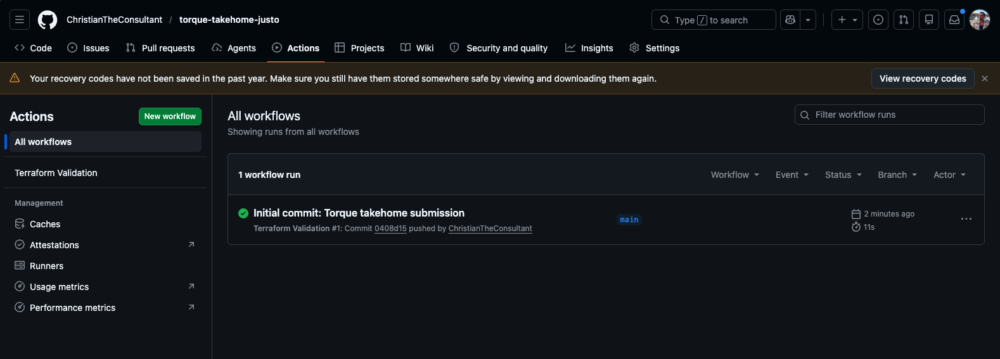
*CI workflow validates fmt, init, validate, and tflint against the Terraform module on every push and pull request. Initial commit passed in 11 seconds.*

### 3. Connect the repo

Registered this GitHub repo in Torque under **Repositories** with a personal access token scoped to the single repo. After syncing, Torque's asset discovery surfaced the `terraform/` directory as a Terraform module, with its `variable` blocks pre-populated as candidate blueprint inputs and its `output` blocks pre-populated as candidate grain outputs.

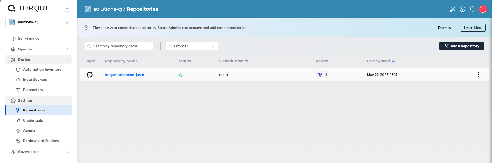
*GitHub repo registered in Torque as `torque-takehome-justo`. The repo name matches the `source.store` value in the blueprint YAML, which is the binding mechanism.*

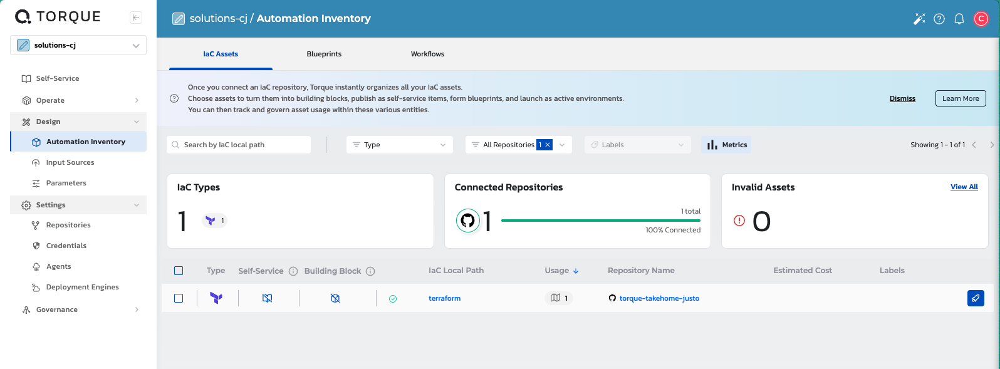
*After sync, Torque's asset discovery surfaces the `terraform/` directory as a Terraform IaC asset, ready to be composed into a blueprint.*

### 4. Create the blueprint

The blueprint at [`blueprints/simple-environment.yaml`](./blueprints/simple-environment.yaml) lives in this repo and was discovered by Torque alongside the Terraform module when the repo was synced. No edits in the Torque UI were needed: the YAML I committed locally was the YAML Torque used to launch the environment. That GitOps shape is the right pattern for customers, and worth calling out independently of this exercise: blueprint definitions live in version control, Torque consumes them, and changes flow through pull requests.

The blueprint declares four inputs (`agent`, `gcp_project_id`, `gcp_region`, `bucket_name_prefix`) and a single `kind: terraform` grain. Two design choices worth calling out:

- **GCP credentials are pulled from Torque's Parameter Store, not from blueprint inputs.** A Parameter named `gcp_sa_key_json` holds the full JSON contents of a service account key. The grain references it as `{{ .params.gcp_sa_key_json }}` and injects it into the agent process as `GOOGLE_CREDENTIALS`. Operators launching the blueprint never see the credential and never need to paste it.
- **Outputs are exposed twice: once at the grain level (so they're captured from the TF module), and once at the blueprint level (so they show up in the environment UI).** This is Torque's two-step output exposure model and the YAML reflects it explicitly.

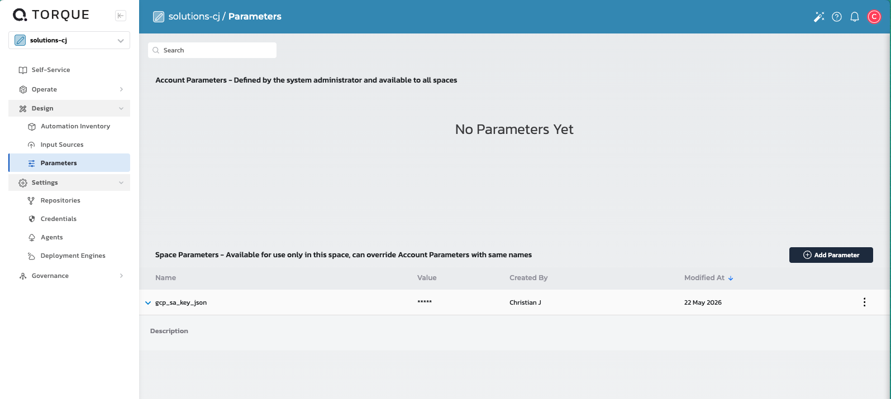
*GCP service account JSON stored as a sensitive Space Parameter named `gcp_sa_key_json`. The blueprint references it via `{{ .params.gcp_sa_key_json }}` so launch operators never see or paste the credential.*

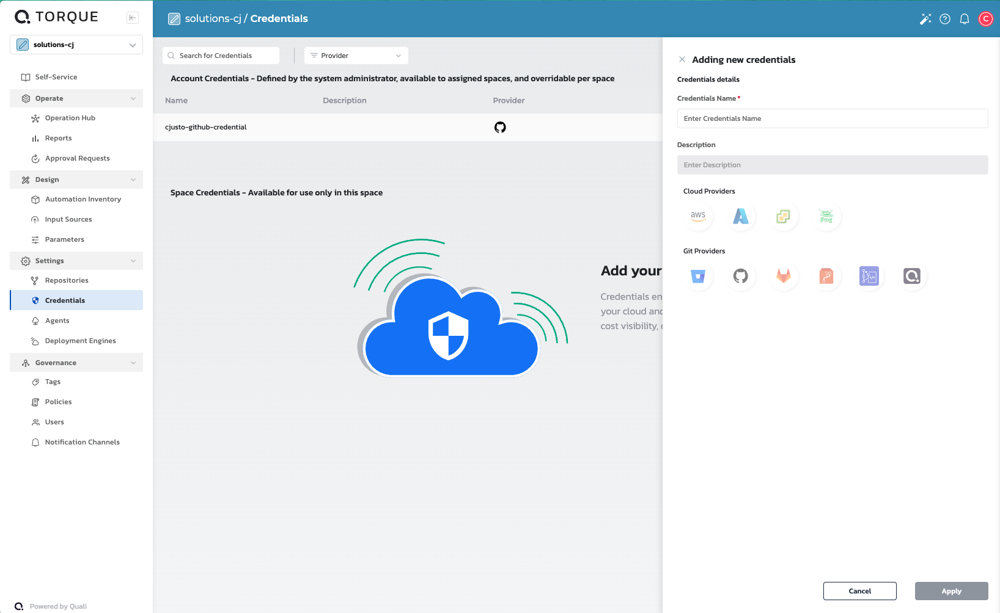
*Torque's Credentials UI as of this exercise: AWS and Azure are first-class typed credential objects, but GCP is not. The Parameter Store path used here is the Quali-documented pattern for GCP, but the asymmetry is worth flagging during customer onboarding.*

### 5. Launch the environment

Launched the blueprint with `gcp_project_id` set to my personal GCP project and the bucket prefix left at its default. The agent picked up the work, ran `terraform init` against the connected repo, then `apply`, and reported a `Running` state on the environment.

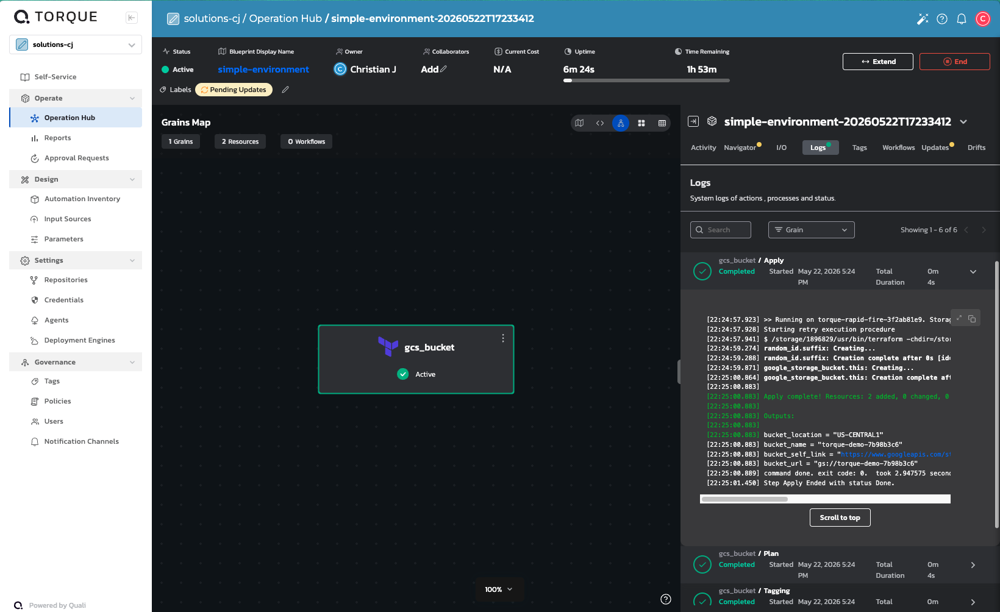
*Per-step logs for the Terraform grain. Each step (Prepare, Init, Plan, Apply, etc.) is captured separately and stays available for post-run review.*

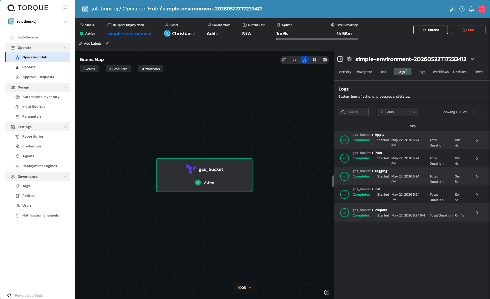
*Environment reached Active state with the gcs_bucket grain Completed. All log entries on the right show Completed status.*

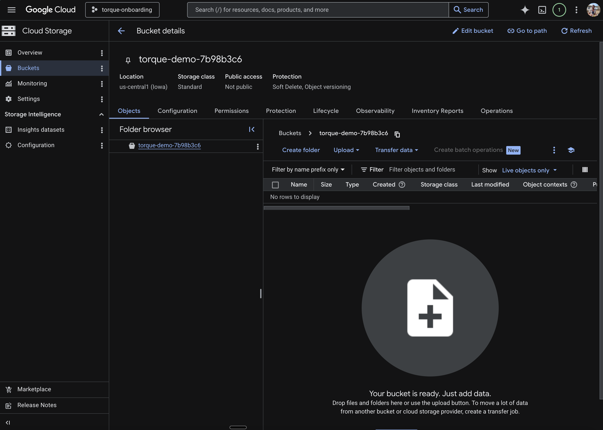
*The Terraform-managed bucket in the GCP console: `us-central1`, Standard class, Soft Delete + Object Versioning enabled, public access prevention enforced. Settings match the module exactly.*

### 6. Surface outputs

The four module outputs (`bucket_name`, `bucket_url`, `bucket_self_link`, `bucket_location`) are captured by the grain and re-exposed at the blueprint level. They appear in the environment details panel after the launch completes.

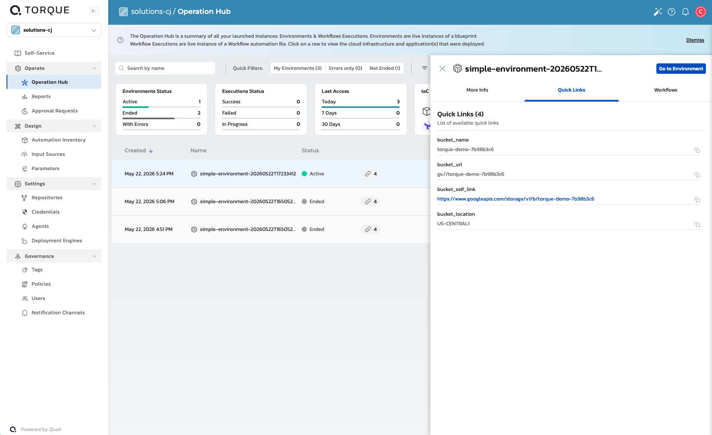
*Outputs surfaced in the environment's Quick Links: `bucket_name`, `bucket_url`, `bucket_self_link`, `bucket_location`. Values flow from the Terraform module outputs through the grain spec to the environment-level outputs.*

## Challenges & workarounds

**ARM architecture isn't supported by the Torque agent.** My laptop is Apple Silicon, so my first instinct was to install the agent into a local minikube cluster. The Torque docs called this out clearly: cluster nodes on ARM architecture are unsupported, because the agent's container image is amd64-only. I caught this before applying the manifest, so no time was lost debugging a pod scheduling failure.

Pivot: spun up a small GKE cluster in the same GCP project the bucket would be created in. One zonal cluster, single `e2-small` node, deleted after submission. The full sequence:

```bash
gcloud container clusters create torque-agent-host \
  --project="$PROJECT_ID" \
  --zone=us-central1-a \
  --num-nodes=1 \
  --machine-type=e2-small \
  --release-channel=regular

gcloud container clusters get-credentials torque-agent-host \
  --zone=us-central1-a --project="$PROJECT_ID"
```

Worth flagging in customer conversations: ARM-only Mac fleets are now common on engineering teams, and the laptop-as-runner mental model breaks down here. The right framing is that Torque's agent belongs in customer infrastructure (a small GKE/EKS/AKS cluster, on-prem K8s, etc.), not on individual developer machines. That's also better for compliance posture, since the agent then runs inside the customer's perimeter rather than across a fleet of laptops.

**Empty space dropdown during agent install.** The PDF flagged this as a known issue and the workaround was correct as described: closing the wizard at the empty-dropdown step, then editing the agent configuration to select the default namespace and default service account, completed registration cleanly. The Edit Agent panel initially shows both `Default Namespace` and `Default Service Account` dropdowns blank (`docs/screenshots/01a-edit-agent-empty.png`); selecting `default` in both and clicking Apply (`docs/screenshots/01b-edit-agent-defaults-selected.png`) flips the agent to a Connected state with the defaults persisted (`docs/screenshots/01-agent-healthy.png`). In a production rollout I would expect this to be smoothed over with either a better default in the wizard or clearer copy directing operators to the post-install edit path. Capturing it here because the PDF specifically asked for friction notes.

**Agent visibility for the blueprint.** After the agent registered, it didn't immediately show up as a selectable option in the blueprint input dropdown. A page refresh resolved it; this is the kind of soft caching behavior worth knowing about when walking a customer through their first launch live.

**GKE node sizing was too small on the first cluster build.** Initially provisioned the agent host cluster with a single `e2-small` node (2 vCPU shared, 2 GB memory). The Torque agent pod fit fine, but when the first environment launch fired, the ephemeral runner pod that Torque schedules to execute the Terraform was Unschedulable. The kube-scheduler event was explicit: `0/1 nodes are available: 1 Insufficient cpu, 1 Insufficient memory` (see `docs/screenshots/07a-first-failure-runner-unschedulable.png`). The runner needs its own resource budget on top of the agent and GKE system pods.

Fix: rolled the node pool to `e2-standard-2` (2 vCPU dedicated, 8 GB) via the standard GKE pattern of adding a new pool, waiting for the node to be Ready, then deleting the old pool. The agent rescheduled onto the new node automatically and the next launch progressed past the scheduling phase.

Worth flagging for customer adoption: the agent's host cluster needs to be sized for both the long-running agent pod AND the per-grain ephemeral runners that spin up during launches. A two-node baseline with workload-class machines is the right starting point, not a single small node. This deserves a paragraph in any customer's adoption runbook.

**GCP credentials handling and Torque's credential store asymmetry.** Torque's Credentials UI (Settings → Credentials) supports AWS and Azure as first-class typed credential objects, plus Git providers. GCP is not a first-class credential type as of this exercise. Per Quali's own documentation and Terraform-secrets blog post, the recommended pattern for GCP is the Parameter Store: store the full JSON SA key as a single sensitive value, then reference it from the blueprint as `{{ .params.<name> }}`. That's what this submission does.

In a customer engagement I'd flag this asymmetry early during onboarding for any GCP-heavy team. It's not a blocker (the pattern works fine and is officially supported), but it does mean GCP customers don't get the structured sub-field references that AWS/Azure customers do (e.g., `{{ .credentials.<name>.access_key }}`). A first-class GCP credential type with fields like `service_account_email` and `private_key` would close that gap and make the customer experience symmetric across the big three clouds. See `docs/screenshots/04a-credentials-no-gcp.png` for the current Credentials UI state.

**Helm grain hit Kubernetes RBAC.** Once the cross-grain reference plumbing was working and the Helm grain actually ran, it failed on the first attempt because the Torque agent's service account (`default:default`, per the agent-install workaround) had no Kubernetes permissions. The error was unambiguous (see `docs/screenshots/11-helm-rbac-failure.png`): `secrets is forbidden: User "system:serviceaccount:default:default" cannot list resource "secrets"`. Helm 3 stores release metadata as Secrets in the target namespace and needs to list them on every `helm upgrade -i`. Resolved with a namespace-scoped RoleBinding granting the `admin` ClusterRole to that SA within the `default` namespace (see `docs/screenshots/11a-helm-rbac-fix.png` for the applied binding). See the Production Hardening Considerations section for the deeper RBAC discussion this exposed.

**Blueprint Designer flagged cross-grain output references as unresolvable at design time.** Three validation errors appeared in the Blueprint Designer of the form `Value '{{ .grains.gcs_bucket.outputs.bucket_name }}' of field '...->gcsBucket' can't be resolved`. Both grains still showed as Valid individually and the launch button was enabled, so this is a non-blocking static-analysis warning (Torque can't introspect the Terraform module's actual outputs at design time, only the grain's declared `outputs:` list). At runtime the references resolved correctly and the Helm grain received the actual bucket name. Worth knowing for customer demos: don't be alarmed by these warnings, but also worth feedback to Quali that runtime-only references should probably be styled differently than hard errors in the UI.

**Runner authentication fell back to node metadata server on first auth attempt.** Initially wired the SA key through Torque's `env_vars` block as `GOOGLE_CREDENTIALS`, which is a documented Terraform Google provider env var. The launch failed with `Error 403: Provided scope(s) are not authorized, forbidden` on the bucket create (see `docs/screenshots/07b-second-failure-auth-scope.png`). That exact error is the signature of OAuth-scope-restricted credentials, specifically the GKE node's default metadata server token (read-only storage scope), not a service account key (which has no OAuth scopes). Diagnostic conclusion: the env-var injection was being silently dropped or rendered empty, and the Google provider was falling back to ADC.

Fix: switched to passing the credential JSON as an explicit Terraform variable wired directly into the provider's `credentials` argument. This is more robust because it routes auth through Terraform's own variable system instead of relying on the runner's env-var passthrough behaving as expected. The fix is also the better engineering pattern independent of this bug: explicit, testable, and visible in the module's interface. Worth noting that this is the path Quali's docs and blog content recommend for GCP, so it lands us back on the documented happy path rather than improvising.

## Production hardening considerations

A few things this blueprint does not yet do that I'd want before recommending the pattern for a real workload. Coming from a Trustwave background, my reflex on a deliverable like this is to walk the threat model before the demo:

- **Credential scope.** The service account key used here has broad Storage Admin permissions. In a customer engagement I'd push for either Workload Identity Federation between the Torque agent's K8s cluster and GCP (no static keys at all), or at minimum a per-blueprint SA scoped to a single resource group with key rotation enforced.
- **State storage.** Terraform state is held by Torque. For multi-team customer environments I'd want to understand Torque's state isolation guarantees (per-environment encryption, access control on read) and the recovery story if Torque's control plane is unreachable.
- **Agent isolation.** A single agent running blueprints across multiple customer projects is a blast-radius concern. The right pattern is one agent per security boundary (per tenant, per environment class). Worth surfacing early in a customer's adoption plan.
- **Agent service account RBAC.** The Helm grain in this submission failed on first attempt with `secrets is forbidden: User "system:serviceaccount:default:default" cannot list resource "secrets"`. The Torque agent was configured (per the documented workaround for the empty-dropdown issue) to run as the `default:default` service account, which has no permissions in Kubernetes by default. Helm 3 stores release metadata as Secrets and needs to list them on every `helm upgrade -i`. Resolved with a single namespace-scoped RoleBinding (`kubectl create rolebinding torque-agent-helm-admin --clusterrole=admin --serviceaccount=default:default --namespace=default`). For a real customer engagement I'd push for a dedicated service account with a minimal custom Role rather than the built-in `admin` ClusterRole, and I'd want the agent install wizard to surface the SA-permissions question explicitly rather than defaulting to `default:default`.
- **Agent host sizing and capacity.** As documented in the Challenges section, the agent's host cluster has to be sized for both the long-running agent pod and the per-grain ephemeral runners. For a real engagement, recommend a baseline of at least two workload-class nodes with cluster autoscaler enabled, plus pod-level resource requests on the runner so the scheduler has accurate information. Cluster sizing is a footgun on a small cluster and easy to overlook until the first non-trivial launch fails.
- **Bucket defaults.** `public_access_prevention=enforced` and `uniform_bucket_level_access=true` are in this module because they should be the default. A customer team retrofitting an existing TF estate into Torque should expect these as a gate, not as a code review nit.
- **Secret references in YAML.** `{{ .params.gcp_sa_key_json }}` is fine, but in a real engagement I'd want a clear audit trail: who can read that parameter, when was it last rotated, and is its rotation tied to the SA key lifecycle in GCP. This is the kind of audit gap I'd want Torque to either solve natively or integrate with the customer's existing secrets manager.
- **Parameter Store vs. Credentials.** I used Torque's Parameter Store for the SA JSON because the blueprint references it directly via `{{ .params.x }}`, and a single-string parameter is the path of least resistance. Torque also exposes a dedicated **Credentials** entry under space settings that looks purpose-built for multi-field cloud auth. In a real customer engagement I'd probably evaluate that store first since it has stronger semantics around credential lifecycle, and only fall back to Parameter Store for non-credential configuration.

## How I'd position this with a customer

The simplest framing of Torque from this exercise: **it's the layer that turns IaC modules into composable environments without surrendering the IaC.** The Terraform module in this repo is unchanged from how I'd write it for direct `terraform apply` use. Torque doesn't ask you to rewrite, it asks you to declare *how a module participates in an environment*. That's the conversation I'd want to have with a customer's platform team, because it answers the "what does adopting this cost us in re-platforming" question with: very little.

The three points I'd lead with on a discovery call after this exercise:

1. **Self-service without bypass.** The blueprint exposes a small, deliberate surface (project, region, prefix) and hides credentials and orchestration behind it. Application teams can launch environments without holding cloud credentials, and platform teams retain control of the IaC.
2. **Composability without coupling.** The blueprint references a Terraform module by path in a repo. Swapping that module out, or composing multiple grains across Terraform, Helm, and shell scripts, is a YAML change. There is no Torque-specific code in the module itself. The blueprint YAML lives in the same repo as the module and is discovered by Torque automatically: a customer team can keep their entire environment definition under PR review without leaving git.
3. **Agent-based execution as a tenancy boundary.** Agents are where the customer's compliance posture meets Torque's orchestration. The fact that one is required, and that it runs in the customer's cluster, is a feature for regulated industries; it means cloud credentials and state never leave the customer's perimeter.

## What I'd build next

The Helm grain bonus already demonstrates output passing between grains within a single blueprint. The next extension I'd reach for, which I'd estimate at a half day rather than an hour, is an environment-tear-down workflow with a GitHub Actions trigger that calls the Torque API. This closes the GitOps loop and demonstrates the patterns customers actually want for ephemeral preview environments.

After that, the natural sequence is multi-environment promotion: a single blueprint launching parallel dev / stage / prod environments with environment-scoped parameters and different agent assignments per stage. That's where Torque's value proposition gets concrete for an SRE org that's been wrestling with Terraform workspaces and CI-driven deploys.

## Bonus extensions

The PDF offers a bonus for a CI/CD hook OR a second grain. Both are included.

### CI/CD bonus: GitHub Actions Terraform validation

The workflow at `.github/workflows/terraform-validate.yml` runs on every pull request and every push to `main` that touches `terraform/`. It performs:

- `terraform fmt -check -recursive -diff` for format gating
- `terraform init -backend=false` + `terraform validate` for syntax and provider consistency
- `tflint --recursive` for opinionated lint with the default ruleset

The intent is to catch the boring failures (forgotten variables, drifted formatting, invalid HCL) before the agent picks the module up. In a real engagement I'd extend this with `tfsec` or `checkov` for security policy enforcement and `terraform plan` against a long-lived `plan-only` workspace for diff review on PRs.

### Second grain bonus: Helm chart with cross-grain output reference

The blueprint also composes a `kind: helm` grain alongside the Terraform grain. The Helm chart at `helm/bucket-info/` deploys a single ConfigMap into the GKE cluster the agent is running on. The ConfigMap's data fields are populated at deploy time from the Terraform grain's outputs:

```yaml
# inside the blueprint, helm grain spec
inputs:
  - gcsBucket:         '{{ .grains.gcs_bucket.outputs.bucket_name }}'
  - gcsBucketUrl:      '{{ .grains.gcs_bucket.outputs.bucket_url }}'
  - gcsBucketLocation: '{{ .grains.gcs_bucket.outputs.bucket_location }}'
  - environmentName:   '{{ envid | downcase }}'
```

This is a deliberately tiny Helm payload (no pods, no images, no service exposure) because the point is the orchestration pattern, not the workload. Two things to call out about the result:

1. **Torque resolves the cross-grain dependency automatically.** I did not need a `depends-on` directive on the Helm grain. The output reference is sufficient for Torque to sequence the Helm grain after the Terraform grain.
2. **The Helm grain targets the same cluster the agent runs in.** Because `agent.name` selects an agent that's already inside the cluster, no separate kubeconfig wiring is required. This is the simplest Helm deployment story for a customer onboarding into Torque on K8s: agent and workload in the same cluster, sized appropriately.

In a real customer engagement this is the shape of nearly every environment definition: an infrastructure grain (Terraform / CloudFormation) produces outputs that an application grain (Helm / kubectl / scripts) consumes. Demonstrating it on a hello-world payload here lets the reviewer focus on the wiring, not the workload.

Evidence of the end-to-end composition:

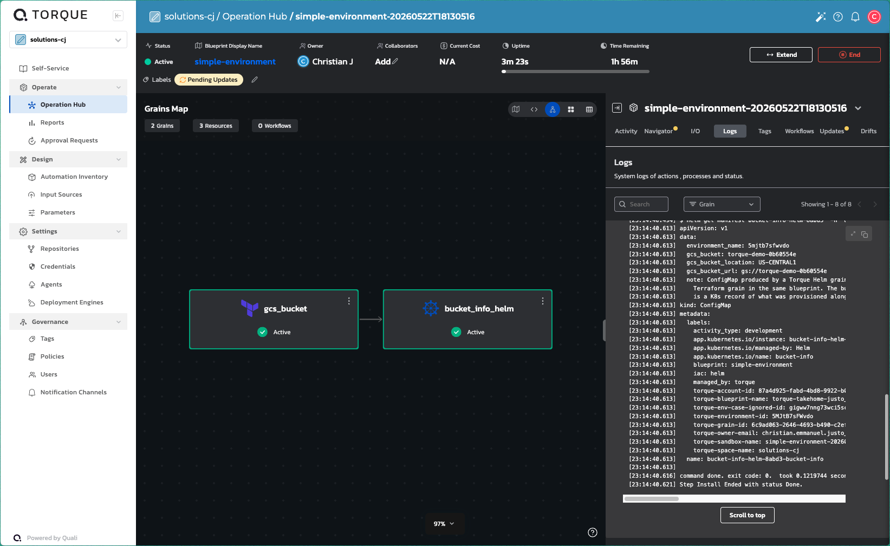
*Both grains Active in the same environment. The arrow between them is Torque's visualization of the `depends-on` relationship: the Helm grain waited for the Terraform grain to finish and emit its outputs.*

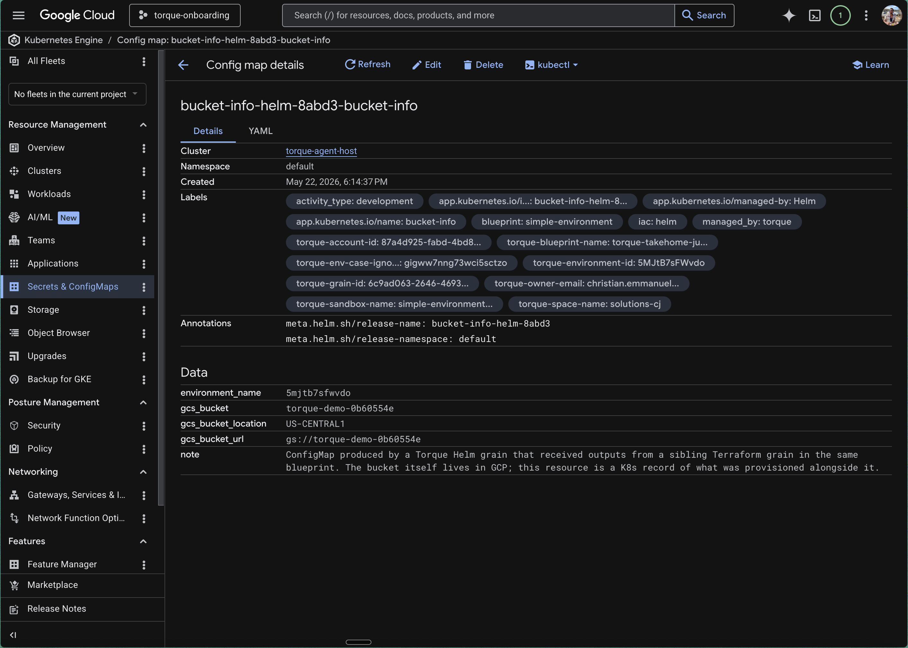
*The ConfigMap in the GCP Console Kubernetes Engine view. The `gcs_bucket` data field contains `torque-demo-8b6055be`, the actual name of the bucket the Terraform grain created on the same launch. The bucket name was passed across grains at runtime via `{{ .grains.gcs_bucket.outputs.bucket_name }}`, not hardcoded.*

---

If anything in this submission would be more useful as a walkthrough than as a document, happy to demo it live.
